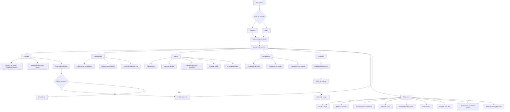

# PRD - Mãos na Obra

## 1. Visão geral

O **Mãos na Obra** é um sistema web de gestão de obras para centralizar operações de clientes, fornecedores, obras, orçamentos, compras e financeiro em uma aplicação Django full stack.

O produto deve atender equipes que hoje dependem de planilhas, mensagens dispersas, arquivos locais e controles financeiros separados. A primeira versão deve priorizar fluxos essenciais, rastreabilidade das informações e uma interface consistente com o arquivo `design_system/design-system.html`.

O projeto não deve seguir uma abordagem de over engineering. A implementação inicial deve usar recursos nativos do Django sempre que possível, SQLite padrão do Django, Class Based Views, Django Templates e assets locais do design system.

## 2. Sobre o produto

O sistema será uma aplicação web com:

- Site público principal de apresentação.
- Cadastro público de usuários.
- Login por email usando autenticação nativa do Django.
- Dashboard principal para usuários autenticados.
- Módulos internos separados por apps Django.
- Portal do cliente para acompanhamento de obras, fotos, documentos e informações liberadas.

Toda a informação exibida para usuários finais deve estar em **português brasileiro**. O código, nomes de apps, modelos, views, forms, templates técnicos, URLs internas e variáveis devem estar em **inglês**.

## 3. Propósito

O propósito do Mãos na Obra é reduzir retrabalho, perda de informação e falta de visibilidade em obras pequenas e médias, permitindo que gestores controlem:

- Relacionamento com clientes.
- Documentos e fotos da obra.
- Fornecedores e cotações.
- Planejamento físico e financeiro.
- Orçamentos de custo e venda.
- Compras, solicitações e ordens de compra.
- Contas a pagar, contas a receber e fluxo de caixa.
- Apropriação financeira por obra e por serviço.

## 4. Público alvo

1. Pequenas e médias construtoras.
2. Engenheiros civis autônomos.
3. Arquitetos e escritórios que administram execução de obras.
4. Administradores de obras por taxa, medição física ou avanço físico.
5. Clientes finais que precisam acompanhar evolução, fotos, documentos e medições no portal do cliente.

## 5. Objetivos

1. Criar uma base Django simples, modular e sustentável.
2. Implementar login por email respeitando o sistema nativo de autenticação do Django.
3. Separar responsabilidades em apps Django por domínio.
4. Criar uma interface única, consistente e baseada rigorosamente em `design_system/design-system.html`.
5. Entregar cadastros e fluxos essenciais antes de automações avançadas.
6. Integrar compras ao financeiro sem criar complexidade desnecessária.
7. Permitir acompanhamento físico e financeiro de cada obra.
8. Manter todos os modelos com `created_at` e `updated_at`.
9. Evitar Docker e testes automatizados nas sprints iniciais, deixando ambos para sprints finais.
10. Usar SQLite padrão do Django na fase inicial.

## 6. Requisitos funcionais

### 6.1 Site público

1. O sistema deve ter uma página pública principal.
2. A página pública deve apresentar o produto de forma objetiva.
3. A página pública deve conter ação para `Cadastre-se`.
4. A página pública deve conter ação para `Login`.
5. Usuários autenticados que acessarem a página pública devem ter acesso ao dashboard.
6. A página pública deve usar apenas componentes e padrões visuais existentes no design system.

### 6.2 Autenticação e usuários

1. O sistema deve usar o sistema nativo de autenticação do Django.
2. O login deve ser feito por email em vez de username.
3. O modelo de usuário deve ser definido no início do projeto para evitar migrações complexas futuras.
4. O cadastro deve solicitar informações mínimas:
   - Nome.
   - Email.
   - Senha.
   - Confirmação de senha.
5. O sistema deve redirecionar usuários autenticados para o dashboard principal.
6. O sistema deve bloquear acesso a telas internas para usuários não autenticados.
7. O sistema deve permitir logout usando views nativas do Django.
8. O Django Admin deve continuar funcional com o modelo customizado de usuário.

### 6.3 Dashboard principal

1. O dashboard deve exibir uma visão geral dos módulos.
2. O dashboard deve exibir quantidade de obras ativas.
3. O dashboard deve exibir resumo de contas a pagar.
4. O dashboard deve exibir resumo de contas a receber.
5. O dashboard deve exibir saldo financeiro simplificado.
6. O dashboard deve exibir cotações pendentes.
7. O dashboard deve exibir compras pendentes de aprovação.
8. O dashboard deve exibir cards e tabelas seguindo o design system.

### 6.4 Clientes

1. O sistema deve permitir cadastro de clientes.
2. O cadastro de cliente deve incluir:
   - Nome.
   - Tipo de pessoa.
   - CPF ou CNPJ.
   - Email.
   - Telefone.
   - Endereço.
   - Observações.
   - Status.
3. O sistema deve permitir listar, visualizar, criar, editar e inativar clientes.
4. O sistema deve permitir registrar interações com o cliente.
5. O relacionamento com o cliente deve incluir:
   - Tipo de interação.
   - Data.
   - Responsável.
   - Descrição.
6. O sistema deve permitir upload de fotos vinculadas ao cliente ou obra.
7. O sistema deve permitir upload de documentos vinculados ao cliente ou obra.
8. O sistema deve permitir marcar documentos e fotos como visíveis no portal do cliente.
9. O sistema deve permitir acesso ao portal do cliente por usuário autenticado e autorizado.

### 6.5 Portal do cliente

1. O portal do cliente deve mostrar apenas informações liberadas para o cliente.
2. O portal deve exibir obras vinculadas ao cliente.
3. O portal deve exibir fotos liberadas.
4. O portal deve exibir documentos liberados.
5. O portal deve exibir resumo de avanço físico liberado.
6. O portal deve exibir medições liberadas.
7. O portal não deve permitir acesso a financeiro interno, compras, fornecedores ou orçamentos internos.

### 6.6 Fornecedores

1. O sistema deve permitir cadastro de fornecedores.
2. O cadastro de fornecedor deve incluir:
   - Razão social ou nome.
   - Nome fantasia.
   - CNPJ ou CPF.
   - Email.
   - Telefone.
   - Endereço.
   - Categorias de fornecimento.
   - Observações.
   - Status.
3. O sistema deve permitir listar, visualizar, criar, editar e inativar fornecedores.
4. O sistema deve permitir vincular fornecedores a insumos ou categorias.
5. O sistema deve permitir selecionar fornecedores para cotação.
6. O sistema deve preparar um fluxo simples de cotação online.

### 6.7 Obras

1. O sistema deve permitir cadastro de obras.
2. O cadastro de obra deve incluir:
   - Nome.
   - Cliente.
   - Endereço.
   - Data prevista de início.
   - Data prevista de término.
   - Status.
   - Valor previsto.
   - Responsável.
   - Descrição.
3. O sistema deve permitir listar obras ativas.
4. O sistema deve permitir visualizar detalhes da obra.
5. O sistema deve permitir registrar o dia a dia da obra.
6. O diário de obra deve conter:
   - Data.
   - Clima.
   - Equipe presente.
   - Serviços executados.
   - Ocorrências.
   - Observações.
7. O sistema deve permitir planejamento físico e financeiro por etapas ou serviços.
8. O sistema deve permitir medição física por serviço.
9. O sistema deve calcular percentual físico executado.
10. O sistema deve exibir cronograma em formato de Diagrama Gantt.
11. O Gantt deve ser simples na primeira versão, sem dependências complexas obrigatórias.

### 6.8 Orçamentos

1. O sistema deve permitir criar orçamento de custo.
2. O sistema deve permitir criar orçamento de venda.
3. O orçamento deve estar vinculado a uma obra.
4. O orçamento deve permitir itens por serviço.
5. O orçamento deve permitir composição por insumo.
6. Cada item de composição deve conter:
   - Insumo.
   - Unidade.
   - Quantidade.
   - Custo unitário.
   - Custo total.
7. O orçamento de venda deve considerar margem ou taxa simples.
8. O sistema deve calcular totais de custo e venda.
9. O sistema deve permitir duplicar um orçamento quando necessário.
10. O sistema deve manter status do orçamento.

### 6.9 Compras

1. O sistema deve permitir solicitação de compra.
2. A solicitação de compra deve estar vinculada a uma obra.
3. A solicitação deve conter itens solicitados.
4. O sistema deve permitir gerar cotação a partir da solicitação.
5. O sistema deve permitir selecionar fornecedores para cotação.
6. O sistema deve permitir registrar propostas de fornecedores.
7. O sistema deve exibir mapa de cotação.
8. O mapa de cotação deve comparar preço por item e total por fornecedor.
9. O sistema deve destacar a melhor condição por menor preço.
10. O sistema deve permitir gerar ordem de compra.
11. A ordem de compra aprovada deve gerar conta a pagar no módulo financeiro.
12. O sistema deve manter status para solicitação, cotação e ordem de compra.

### 6.10 Financeiro

1. O sistema deve permitir contas a pagar.
2. O sistema deve permitir contas a receber.
3. O sistema deve permitir movimentações financeiras.
4. O sistema deve permitir fluxo de caixa.
5. O sistema deve permitir reembolso de compras.
6. O sistema deve permitir faturamento por administração de obra.
7. O sistema deve permitir faturamento por medição física.
8. O sistema deve permitir faturamento por taxa por avanço físico.
9. O sistema deve permitir importar arquivo NFe `.xml`.
10. A importação de NFe deve iniciar simples, extraindo dados essenciais do XML.
11. O sistema deve permitir apropriação financeira por obra.
12. O sistema deve permitir apropriação financeira por serviço.
13. O sistema deve exibir demonstrativos gerenciais básicos.
14. O sistema deve diferenciar valores previstos, realizados, pagos e recebidos.

### 6.11 Flowchart Mermaid com os fluxos de UX

## 7. Requisitos não-funcionais

1. **Framework:** usar Django full stack.
2. **Frontend:** usar Django Templates, HTML, CSS e JavaScript local conforme design system.
3. **Banco de dados:** usar apenas SQLite padrão do Django inicialmente.
4. **Autenticação:** respeitar rigorosamente o sistema nativo de usuários e autenticação do Django.
5. **Login:** usar email como credencial principal.
6. **Arquitetura:** separar domínios em apps Django.
7. **Simplicidade:** evitar over engineering, filas, microsserviços, APIs externas e camadas desnecessárias na versão inicial.
8. **Class Based Views:** usar CBVs sempre que possível.
9. **Código:** escrever código em inglês.
10. **Interface:** escrever toda informação de interface em português brasileiro.
11. **Estilo:** seguir PEP08.
12. **Aspas:** usar aspas simples sempre que possível no código Python.
13. **Auditoria:** toda tabela/model deve ter `created_at` e `updated_at`.
14. **Signals:** se usados, devem ficar em `signals.py` dentro da app correspondente.
15. **Docker:** não implementar inicialmente; planejar para sprint final.
16. **Testes:** não implementar inicialmente; planejar para sprint final.
17. **Responsividade:** todas as telas devem funcionar em desktop e mobile seguindo os padrões do design system.
18. **Uploads:** arquivos devem usar `MEDIA_ROOT` e `MEDIA_URL` do Django.
19. **Admin:** Django Admin deve permanecer disponível para operação técnica.
20. **Internacionalização prática:** labels, mensagens, breadcrumbs, botões e textos devem aparecer em português brasileiro, mesmo com código em inglês.

## 8. Arquitetura técnica

### 8.1 Stack

1. **Linguagem:** Python.
2. **Framework:** Django.
3. **Frontend server-side:** Django Templates.
4. **CSS base:** Bootstrap e tema Duralux disponíveis em `design_system/ref/duralux/css/`.
5. **Ícones:** Feather icons conforme `design_system/design-system.html`.
6. **Gráficos:** ApexCharts disponível nos assets do design system, usado apenas quando necessário em dashboard e financeiro.
7. **Datas:** Date Range Picker disponível nos assets do design system, usado apenas quando necessário.
8. **Banco de dados:** SQLite.
9. **Autenticação:** Django Auth com custom user model baseado em email.
10. **Arquivos:** FileField/ImageField com armazenamento local.
11. **Deploy inicial:** execução tradicional Django sem Docker.

### 8.2 Apps Django previstos

1. `core`
   - Configurações compartilhadas simples.
   - Model base abstrato com `created_at` e `updated_at`.
   - Helpers pequenos e reutilizáveis, se necessários.
2. `accounts`
   - Custom user model.
   - Login por email.
   - Cadastro, logout e permissões básicas.
3. `pages`
   - Site público.
   - Páginas institucionais simples.
4. `dashboard`
   - Dashboard principal autenticado.
   - Cards de resumo.
5. `customers`
   - Clientes.
   - Interações.
   - Fotos e documentos.
6. `client_portal`
   - Área do cliente.
   - Visualizações restritas.
7. `suppliers`
   - Fornecedores.
   - Categorias de fornecedores.
8. `projects`
   - Obras.
   - Diário de obra.
   - Planejamento físico/financeiro.
   - Medições físicas.
   - Cronograma Gantt.
9. `budgets`
   - Orçamentos de custo.
   - Orçamentos de venda.
   - Insumos.
   - Composições.
10. `purchases`
   - Solicitações de compra.
   - Cotações.
   - Mapa de cotação.
   - Ordens de compra.
11. `finance`
   - Contas a pagar.
   - Contas a receber.
   - Movimentações.
   - Fluxo de caixa.
   - Faturamento.
   - Reembolsos.
   - NFe XML.
   - Apropriações.

### 8.3 Estrutura de dados com schemas em formato Mermaid

```mermaid
erDiagram
    USER ||--o{ CUSTOMER : manages
    USER ||--o{ PROJECT : owns
    USER ||--o{ CUSTOMER_INTERACTION : records
    CUSTOMER ||--o{ PROJECT : owns
    CUSTOMER ||--o{ CUSTOMER_DOCUMENT : has
    CUSTOMER ||--o{ CUSTOMER_PHOTO : has
    CUSTOMER ||--o{ CUSTOMER_INTERACTION : has
    CUSTOMER ||--o{ CLIENT_PORTAL_ACCESS : grants

    PROJECT ||--o{ DAILY_LOG : has
    PROJECT ||--o{ PROJECT_TASK : plans
    PROJECT ||--o{ PHYSICAL_MEASUREMENT : measures
    PROJECT ||--o{ BUDGET : has
    PROJECT ||--o{ PURCHASE_REQUEST : requests
    PROJECT ||--o{ FINANCIAL_TRANSACTION : impacts
    PROJECT ||--o{ FINANCIAL_APPROPRIATION : allocates

    SUPPLIER ||--o{ SUPPLIER_CATEGORY_LINK : categorized_by
    SUPPLIER_CATEGORY ||--o{ SUPPLIER_CATEGORY_LINK : groups
    SUPPLIER ||--o{ QUOTATION_SUPPLIER : receives
    SUPPLIER ||--o{ PURCHASE_ORDER : fulfills

    INPUT_ITEM ||--o{ BUDGET_COMPOSITION_ITEM : composes
    BUDGET ||--o{ BUDGET_ITEM : contains
    BUDGET_ITEM ||--o{ BUDGET_COMPOSITION_ITEM : breaks_down

    PURCHASE_REQUEST ||--o{ PURCHASE_REQUEST_ITEM : contains
    PURCHASE_REQUEST ||--o{ QUOTATION : generates
    QUOTATION ||--o{ QUOTATION_SUPPLIER : invites
    QUOTATION_SUPPLIER ||--o{ QUOTATION_ITEM_PRICE : prices
    PURCHASE_REQUEST_ITEM ||--o{ QUOTATION_ITEM_PRICE : compared_as
    QUOTATION ||--o{ PURCHASE_ORDER : converts_to
    PURCHASE_ORDER ||--o{ PURCHASE_ORDER_ITEM : contains
    PURCHASE_ORDER ||--o{ ACCOUNT_PAYABLE : generates

    ACCOUNT_PAYABLE ||--o{ FINANCIAL_TRANSACTION : paid_by
    ACCOUNT_RECEIVABLE ||--o{ FINANCIAL_TRANSACTION : received_by
    INVOICE_XML ||--o{ FINANCIAL_APPROPRIATION : allocates
    FINANCIAL_TRANSACTION ||--o{ FINANCIAL_APPROPRIATION : allocated_as

    USER {
        int id PK
        string email UK
        string name
        boolean is_active
        boolean is_staff
        datetime created_at
        datetime updated_at
    }

    CUSTOMER {
        int id PK
        string name
        string person_type
        string document_number
        string email
        string phone
        string address
        string status
        datetime created_at
        datetime updated_at
    }

    CUSTOMER_INTERACTION {
        int id PK
        int customer_id FK
        int user_id FK
        string interaction_type
        date interaction_date
        text description
        datetime created_at
        datetime updated_at
    }

    CUSTOMER_DOCUMENT {
        int id PK
        int customer_id FK
        int project_id FK
        string title
        string file
        boolean visible_in_portal
        datetime created_at
        datetime updated_at
    }

    CUSTOMER_PHOTO {
        int id PK
        int customer_id FK
        int project_id FK
        string title
        string image
        boolean visible_in_portal
        datetime created_at
        datetime updated_at
    }

    CLIENT_PORTAL_ACCESS {
        int id PK
        int customer_id FK
        int user_id FK
        boolean is_active
        datetime created_at
        datetime updated_at
    }

    SUPPLIER {
        int id PK
        string legal_name
        string trade_name
        string document_number
        string email
        string phone
        string address
        string status
        datetime created_at
        datetime updated_at
    }

    SUPPLIER_CATEGORY {
        int id PK
        string name
        datetime created_at
        datetime updated_at
    }

    SUPPLIER_CATEGORY_LINK {
        int id PK
        int supplier_id FK
        int supplier_category_id FK
        datetime created_at
        datetime updated_at
    }

    PROJECT {
        int id PK
        int customer_id FK
        int owner_id FK
        string name
        string address
        date planned_start_date
        date planned_end_date
        string status
        decimal planned_amount
        text description
        datetime created_at
        datetime updated_at
    }

    DAILY_LOG {
        int id PK
        int project_id FK
        date log_date
        string weather
        text team
        text executed_services
        text occurrences
        text notes
        datetime created_at
        datetime updated_at
    }

    PROJECT_TASK {
        int id PK
        int project_id FK
        string name
        date start_date
        date end_date
        decimal planned_cost
        decimal planned_percentage
        string status
        datetime created_at
        datetime updated_at
    }

    PHYSICAL_MEASUREMENT {
        int id PK
        int project_id FK
        int project_task_id FK
        date measurement_date
        decimal measured_percentage
        decimal measured_amount
        boolean visible_in_portal
        datetime created_at
        datetime updated_at
    }

    INPUT_ITEM {
        int id PK
        string name
        string unit
        decimal reference_cost
        datetime created_at
        datetime updated_at
    }

    BUDGET {
        int id PK
        int project_id FK
        string name
        string budget_type
        string status
        decimal total_cost
        decimal total_sale
        datetime created_at
        datetime updated_at
    }

    BUDGET_ITEM {
        int id PK
        int budget_id FK
        string service_name
        string unit
        decimal quantity
        decimal unit_cost
        decimal total_cost
        decimal sale_price
        datetime created_at
        datetime updated_at
    }

    BUDGET_COMPOSITION_ITEM {
        int id PK
        int budget_item_id FK
        int input_item_id FK
        decimal quantity
        decimal unit_cost
        decimal total_cost
        datetime created_at
        datetime updated_at
    }

    PURCHASE_REQUEST {
        int id PK
        int project_id FK
        int requested_by_id FK
        string status
        date requested_date
        text notes
        datetime created_at
        datetime updated_at
    }

    PURCHASE_REQUEST_ITEM {
        int id PK
        int purchase_request_id FK
        int input_item_id FK
        string description
        string unit
        decimal quantity
        datetime created_at
        datetime updated_at
    }

    QUOTATION {
        int id PK
        int purchase_request_id FK
        string status
        date due_date
        datetime created_at
        datetime updated_at
    }

    QUOTATION_SUPPLIER {
        int id PK
        int quotation_id FK
        int supplier_id FK
        string status
        datetime created_at
        datetime updated_at
    }

    QUOTATION_ITEM_PRICE {
        int id PK
        int quotation_supplier_id FK
        int purchase_request_item_id FK
        decimal unit_price
        decimal total_price
        datetime created_at
        datetime updated_at
    }

    PURCHASE_ORDER {
        int id PK
        int project_id FK
        int supplier_id FK
        int quotation_id FK
        string status
        decimal total_amount
        date order_date
        datetime created_at
        datetime updated_at
    }

    PURCHASE_ORDER_ITEM {
        int id PK
        int purchase_order_id FK
        int input_item_id FK
        string description
        string unit
        decimal quantity
        decimal unit_price
        decimal total_price
        datetime created_at
        datetime updated_at
    }

    ACCOUNT_PAYABLE {
        int id PK
        int project_id FK
        int supplier_id FK
        int purchase_order_id FK
        string description
        decimal amount
        date due_date
        string status
        datetime created_at
        datetime updated_at
    }

    ACCOUNT_RECEIVABLE {
        int id PK
        int project_id FK
        int customer_id FK
        string billing_type
        string description
        decimal amount
        date due_date
        string status
        datetime created_at
        datetime updated_at
    }

    FINANCIAL_TRANSACTION {
        int id PK
        int project_id FK
        string transaction_type
        string description
        decimal amount
        date transaction_date
        datetime created_at
        datetime updated_at
    }

    INVOICE_XML {
        int id PK
        int project_id FK
        string access_key
        string issuer_name
        decimal total_amount
        string xml_file
        datetime created_at
        datetime updated_at
    }

    FINANCIAL_APPROPRIATION {
        int id PK
        int project_id FK
        int project_task_id FK
        string source_type
        int source_id
        decimal amount
        datetime created_at
        datetime updated_at
    }
```

### 8.4 Convenções técnicas

1. Apps, modelos, forms, views e services devem usar nomes em inglês.
2. Templates podem ter nomes em inglês, mas todo texto renderizado deve estar em português brasileiro.
3. Models devem herdar de uma base abstrata simples com `created_at` e `updated_at`.
4. Views CRUD devem usar `ListView`, `DetailView`, `CreateView`, `UpdateView` e `DeleteView` quando aplicável.
5. Exclusão física deve ser evitada para entidades principais; usar status `active` ou `inactive` quando fizer sentido.
6. Regras de integração simples podem ficar em métodos de modelo ou funções de serviço pequenas.
7. Signals só devem ser usados quando forem a opção mais simples para manter integração automática, como criar uma conta a pagar ao aprovar uma ordem de compra.
8. Arquivos `signals.py` devem ficar dentro da app dona do evento.

## 9. Design system

### 9.1 Referência obrigatória

O frontend deve seguir rigorosamente o arquivo:

- `design_system/design-system.html`

O pedido menciona `@design_system/design-system.htm`; no projeto o arquivo existente é `design_system/design-system.html`. Este PRD considera esse arquivo local como a fonte de verdade.

### 9.2 Diretrizes de uso

1. Não adicionar componentes visuais fora do design system.
2. Não criar identidade visual paralela.
3. Não criar estilos globais novos quando a classe já existir no design system.
4. Usar layout com:
   - `nxl-navigation`.
   - `nxl-header`.
   - `nxl-container`.
   - `nxl-content`.
   - `page-header`.
   - `main-content`.
5. Usar cards com:
   - `card`.
   - `stretch`.
   - `stretch-full`.
   - `card-header`.
   - `card-body`.
   - `card-footer` quando necessário.
6. Usar tabelas com:
   - `table`.
   - `table-hover`.
   - `table-responsive`.
7. Usar botões com:
   - `btn`.
   - `btn-primary`.
   - `btn-light-brand`.
   - `btn-danger`.
8. Usar badges com:
   - `badge`.
   - `bg-soft-success`.
   - `text-success`.
   - `bg-gray-200`.
   - `text-dark`.
9. Usar ícones Feather já presentes no design system.
10. Usar breadcrumbs, dropdowns, filtros, inputs e estados conforme exemplos do arquivo.
11. Labels, botões, menus, mensagens e breadcrumbs devem estar em português brasileiro.
12. Navegação lateral deve conter apenas módulos reais do sistema:
   - Dashboard.
   - Clientes.
   - Fornecedores.
   - Obras.
   - Orçamentos.
   - Compras.
   - Financeiro.
   - Portal do cliente quando aplicável.
13. A página pública também deve derivar dos padrões do design system e não deve introduzir seções ou componentes fora dele.

## 10. User stories

### 10.1 Épico: Site público e autenticação

Como visitante, quero conhecer o sistema, criar minha conta e fazer login por email para acessar o dashboard.

**Critérios de aceite**

- [ ] A página pública exibe ações de `Cadastre-se` e `Login`.
- [ ] O cadastro cria um usuário válido do Django.
- [ ] O login usa email e senha.
- [ ] Usuário autenticado é redirecionado ao dashboard.
- [ ] Usuário não autenticado não acessa telas internas.
- [ ] Django Admin funciona com o usuário customizado.

### 10.2 Épico: Dashboard principal

Como gestor, quero visualizar os principais indicadores do sistema para decidir onde atuar primeiro.

**Critérios de aceite**

- [ ] Dashboard exibe quantidade de obras ativas.
- [ ] Dashboard exibe contas a pagar pendentes.
- [ ] Dashboard exibe contas a receber pendentes.
- [ ] Dashboard exibe cotações pendentes.
- [ ] Dashboard exibe compras pendentes.
- [ ] Cards e tabelas seguem o design system.

### 10.3 Épico: Clientes e relacionamento

Como gestor, quero cadastrar clientes, registrar interações e organizar documentos para manter histórico centralizado.

**Critérios de aceite**

- [ ] É possível criar, listar, visualizar, editar e inativar clientes.
- [ ] É possível registrar interações por cliente.
- [ ] É possível anexar documentos.
- [ ] É possível anexar fotos.
- [ ] É possível marcar fotos e documentos como visíveis no portal.
- [ ] A interface exibe textos em português brasileiro.

### 10.4 Épico: Portal do cliente

Como cliente, quero acessar informações liberadas da minha obra para acompanhar evolução sem depender de mensagens avulsas.

**Critérios de aceite**

- [ ] Cliente acessa apenas obras vinculadas a ele.
- [ ] Cliente visualiza apenas documentos liberados.
- [ ] Cliente visualiza apenas fotos liberadas.
- [ ] Cliente visualiza apenas medições liberadas.
- [ ] Cliente não acessa módulos internos.

### 10.5 Épico: Fornecedores e cotações

Como comprador, quero cadastrar fornecedores e enviar cotações para comparar preços de forma organizada.

**Critérios de aceite**

- [ ] É possível criar, listar, visualizar, editar e inativar fornecedores.
- [ ] É possível vincular categorias ao fornecedor.
- [ ] É possível selecionar fornecedores em uma cotação.
- [ ] É possível registrar preços recebidos.
- [ ] O mapa de cotação compara fornecedores por item.

### 10.6 Épico: Obras e diário

Como gestor de obra, quero acompanhar o dia a dia e o avanço físico da obra para manter histórico técnico confiável.

**Critérios de aceite**

- [ ] É possível criar, listar, visualizar, editar e inativar obras.
- [ ] A obra fica vinculada a um cliente.
- [ ] É possível registrar diário de obra.
- [ ] É possível cadastrar tarefas ou etapas do planejamento.
- [ ] É possível registrar medição física.
- [ ] O sistema calcula avanço físico executado.
- [ ] O sistema exibe cronograma Gantt simples.

### 10.7 Épico: Orçamentos

Como orçamentista, quero montar orçamento de custo e venda por composição para controlar a formação de preço.

**Critérios de aceite**

- [ ] É possível cadastrar insumos.
- [ ] É possível criar orçamento de custo.
- [ ] É possível criar orçamento de venda.
- [ ] É possível adicionar itens de serviço ao orçamento.
- [ ] É possível adicionar composição por insumo.
- [ ] O sistema calcula custo total.
- [ ] O sistema calcula venda total.

### 10.8 Épico: Compras

Como comprador, quero transformar solicitações em cotações e ordens de compra para controlar aquisição de materiais e serviços.

**Critérios de aceite**

- [ ] É possível criar solicitação de compra vinculada a uma obra.
- [ ] É possível adicionar itens solicitados.
- [ ] É possível gerar cotação a partir da solicitação.
- [ ] É possível montar mapa de cotação.
- [ ] É possível aprovar fornecedor escolhido.
- [ ] É possível gerar ordem de compra.
- [ ] Ordem de compra aprovada gera conta a pagar.

### 10.9 Épico: Financeiro

Como financeiro, quero controlar contas, movimentações, faturamentos e apropriações para entender o resultado por obra.

**Critérios de aceite**

- [ ] É possível criar contas a pagar.
- [ ] É possível criar contas a receber.
- [ ] É possível registrar pagamento.
- [ ] É possível registrar recebimento.
- [ ] É possível visualizar fluxo de caixa.
- [ ] É possível registrar reembolso.
- [ ] É possível gerar faturamento por administração.
- [ ] É possível gerar faturamento por medição física.
- [ ] É possível gerar faturamento por avanço físico.
- [ ] É possível importar NFe XML com dados essenciais.
- [ ] É possível apropriar valores por obra e serviço.
- [ ] É possível visualizar demonstrativos gerenciais básicos.

## 11. Métricas de sucesso

### 11.1 KPIs de produto

1. Percentual de módulos essenciais implementados por sprint.
2. Quantidade de fluxos CRUD concluídos.
3. Quantidade de telas seguindo o design system sem exceções visuais.
4. Tempo médio para cadastrar uma obra.
5. Tempo médio para gerar uma solicitação de compra.
6. Tempo médio para gerar uma ordem de compra a partir de uma cotação.

### 11.2 KPIs de usuário

1. Quantidade de usuários cadastrados.
2. Quantidade de usuários ativos por semana.
3. Quantidade de obras ativas por usuário.
4. Quantidade de clientes com portal habilitado.
5. Quantidade de interações registradas por cliente.

### 11.3 KPIs operacionais

1. Quantidade de diários de obra registrados por obra.
2. Percentual de obras com planejamento físico cadastrado.
3. Percentual de obras com medição física atualizada.
4. Quantidade de cotações comparadas no mapa de cotação.
5. Percentual de ordens de compra integradas ao contas a pagar.

### 11.4 KPIs financeiros

1. Total de contas a pagar pendentes.
2. Total de contas a receber pendentes.
3. Saldo previsto do fluxo de caixa.
4. Diferença entre custo orçado e custo realizado por obra.
5. Diferença entre faturamento previsto e faturamento realizado.
6. Percentual de despesas apropriadas por obra e serviço.

## 12. Riscos e mitigações

1. **Risco:** Escopo muito amplo para a primeira versão.
   - **Mitigação:** dividir a entrega em sprints pequenas e priorizar CRUDs e integrações essenciais.
2. **Risco:** Criação de abstrações complexas cedo demais.
   - **Mitigação:** usar Django nativo, CBVs e models simples antes de criar serviços ou camadas adicionais.
3. **Risco:** Custom user model mal definido causar retrabalho.
   - **Mitigação:** criar `accounts.User` na primeira sprint antes das demais migrations.
4. **Risco:** Interface inconsistente.
   - **Mitigação:** criar templates base reutilizáveis a partir de `design_system/design-system.html`.
5. **Risco:** Gantt ficar complexo.
   - **Mitigação:** implementar Gantt simples baseado em tarefas com datas de início e fim, sem dependências avançadas na primeira versão.
6. **Risco:** Importação de NFe XML variar conforme emissor.
   - **Mitigação:** começar extraindo campos essenciais e registrar falhas de leitura de forma clara para o usuário.
7. **Risco:** SQLite limitar uso em produção maior.
   - **Mitigação:** aceitar SQLite como restrição inicial e manter models compatíveis com migração futura para PostgreSQL.
8. **Risco:** Portal do cliente vazar informação interna.
   - **Mitigação:** criar app separado, filtros por cliente e flags explícitas de visibilidade.
9. **Risco:** Integração compras-financeiro duplicar contas a pagar.
   - **Mitigação:** vincular `AccountPayable` à `PurchaseOrder` e impedir geração duplicada.
10. **Risco:** Ausência de testes nas primeiras sprints.
    - **Mitigação:** manter implementação simples, validar manualmente por checklist e reservar sprint final para testes automatizados.

## 13. Lista de tarefas

### 13.1 Sprint 1 - Fundação do projeto e autenticação

- [x] **1.1 Criar estrutura inicial Django**
  - [x] **1.1.1** Criar ambiente virtual Python local.
  - [x] **1.1.2** Instalar Django.
  - [x] **1.1.3** Criar projeto Django principal.
  - [x] **1.1.4** Criar arquivo `requirements.txt`.
  - [x] **1.1.5** Confirmar que o projeto executa com SQLite.
  - [x] **1.1.6** Configurar `LANGUAGE_CODE = 'pt-br'`.
  - [x] **1.1.7** Configurar timezone do projeto.
  - [x] **1.1.8** Configurar `STATIC_URL`.
  - [x] **1.1.9** Configurar `MEDIA_URL`.
  - [x] **1.1.10** Configurar `MEDIA_ROOT`.

- [x] **1.2 Criar app `core`**
  - [x] **1.2.1** Criar app `core`.
  - [x] **1.2.2** Registrar app em `INSTALLED_APPS`.
  - [x] **1.2.3** Criar model abstrato `TimeStampedModel`.
  - [x] **1.2.4** Adicionar campo `created_at`.
  - [x] **1.2.5** Adicionar campo `updated_at`.
  - [x] **1.2.6** Documentar que models principais devem herdar de `TimeStampedModel`.

- [x] **1.3 Criar app `accounts`**
  - [x] **1.3.1** Criar app `accounts`.
  - [x] **1.3.2** Registrar app em `INSTALLED_APPS`.
  - [x] **1.3.3** Criar custom user model com email único.
  - [x] **1.3.4** Criar custom user manager.
  - [x] **1.3.5** Configurar `USERNAME_FIELD = 'email'`.
  - [x] **1.3.6** Configurar `AUTH_USER_MODEL`.
  - [x] **1.3.7** Registrar usuário customizado no Django Admin.
  - [x] **1.3.8** Criar migration inicial antes de outros apps.

- [x] **1.4 Implementar autenticação**
  - [x] **1.4.1** Criar form de cadastro.
  - [x] **1.4.2** Criar view de cadastro com CBV.
  - [x] **1.4.3** Configurar view nativa de login.
  - [x] **1.4.4** Configurar autenticação por email.
  - [x] **1.4.5** Configurar view nativa de logout.
  - [x] **1.4.6** Configurar redirects de login e logout.
  - [x] **1.4.7** Proteger rotas internas com `LoginRequiredMixin`.

- [x] **1.5 Criar templates base**
  - [x] **1.5.1** Criar diretório global de templates.
  - [x] **1.5.2** Criar template base público.
  - [x] **1.5.3** Criar template base autenticado.
  - [x] **1.5.4** Copiar referências de CSS do design system.
  - [x] **1.5.5** Copiar referências de JS do design system.
  - [x] **1.5.6** Montar sidebar com módulos reais.
  - [x] **1.5.7** Montar header com padrão `nxl-header`.
  - [x] **1.5.8** Montar container com padrão `nxl-container`.
  - [x] **1.5.9** Criar componentes parciais para breadcrumbs.
  - [x] **1.5.10** Criar componentes parciais para mensagens do Django.

- [x] **1.6 Criar app `pages`**
  - [x] **1.6.1** Criar app `pages`.
  - [x] **1.6.2** Criar view da página pública.
  - [x] **1.6.3** Criar template da página pública.
  - [x] **1.6.4** Adicionar botões `Cadastre-se` e `Login`.
  - [x] **1.6.5** Garantir que a página use apenas componentes do design system.

### 13.2 Sprint 2 - Dashboard e navegação interna

- [x] **2.1 Criar app `dashboard`**
  - [x] **2.1.1** Criar app `dashboard`.
  - [x] **2.1.2** Registrar app em `INSTALLED_APPS`.
  - [x] **2.1.3** Criar `DashboardView` com `LoginRequiredMixin`.
  - [x] **2.1.4** Configurar URL do dashboard.
  - [x] **2.1.5** Configurar redirect pós-login para dashboard.

- [x] **2.2 Implementar layout do dashboard**
  - [x] **2.2.1** Criar page header com breadcrumb.
  - [x] **2.2.2** Criar card de obras ativas.
  - [x] **2.2.3** Criar card de contas a pagar.
  - [x] **2.2.4** Criar card de contas a receber.
  - [x] **2.2.5** Criar card de cotações pendentes.
  - [x] **2.2.6** Criar área de tabela para últimas movimentações.
  - [x] **2.2.7** Criar estado vazio em português brasileiro.

- [x] **2.3 Implementar navegação**
  - [x] **2.3.1** Adicionar link `Dashboard` na sidebar.
  - [x] **2.3.2** Adicionar link `Clientes` na sidebar.
  - [x] **2.3.3** Adicionar link `Fornecedores` na sidebar.
  - [x] **2.3.4** Adicionar link `Obras` na sidebar.
  - [x] **2.3.5** Adicionar link `Orçamentos` na sidebar.
  - [x] **2.3.6** Adicionar link `Compras` na sidebar.
  - [x] **2.3.7** Adicionar link `Financeiro` na sidebar.
  - [x] **2.3.8** Destacar item ativo conforme rota atual.

### 13.3 Sprint 3 - Clientes, relacionamento, fotos e documentos

- [x] **3.1 Criar app `customers`**
  - [x] **3.1.1** Criar app `customers`.
  - [x] **3.1.2** Registrar app em `INSTALLED_APPS`.
  - [x] **3.1.3** Criar model `Customer`.
  - [x] **3.1.4** Adicionar campos principais do cliente.
  - [x] **3.1.5** Herdar de `TimeStampedModel`.
  - [x] **3.1.6** Criar migration.
  - [x] **3.1.7** Registrar model no Django Admin.

- [x] **3.2 Implementar CRUD de clientes**
  - [x] **3.2.1** Criar `CustomerListView`.
  - [x] **3.2.2** Criar `CustomerDetailView`.
  - [x] **3.2.3** Criar `CustomerCreateView`.
  - [x] **3.2.4** Criar `CustomerUpdateView`.
  - [x] **3.2.5** Criar ação de inativação.
  - [x] **3.2.6** Criar `CustomerForm`.
  - [x] **3.2.7** Criar template de lista.
  - [x] **3.2.8** Criar template de detalhe.
  - [x] **3.2.9** Criar template de formulário.
  - [x] **3.2.10** Adicionar mensagens de sucesso e erro.

- [x] **3.3 Implementar relacionamento com cliente**
  - [x] **3.3.1** Criar model `CustomerInteraction`.
  - [x] **3.3.2** Adicionar relacionamento com `Customer`.
  - [x] **3.3.3** Adicionar relacionamento com usuário responsável.
  - [x] **3.3.4** Criar form de interação.
  - [x] **3.3.5** Criar view para registrar interação.
  - [x] **3.3.6** Exibir interações no detalhe do cliente.
  - [x] **3.3.7** Registrar model no Admin.

- [x] **3.4 Implementar fotos e documentos**
  - [x] **3.4.1** Criar model `CustomerPhoto`.
  - [x] **3.4.2** Criar model `CustomerDocument`.
  - [x] **3.4.3** Adicionar campo `visible_in_portal`.
  - [x] **3.4.4** Criar forms de upload.
  - [x] **3.4.5** Criar views de upload.
  - [x] **3.4.6** Criar listagem de fotos no detalhe do cliente.
  - [x] **3.4.7** Criar listagem de documentos no detalhe do cliente.
  - [x] **3.4.8** Configurar arquivos de mídia em desenvolvimento.
  - [x] **3.4.9** Registrar models no Admin.

### 13.4 Sprint 4 - Fornecedores e categorias

- [x] **4.1 Criar app `suppliers`**
  - [x] **4.1.1** Criar app `suppliers`.
  - [x] **4.1.2** Registrar app em `INSTALLED_APPS`.
  - [x] **4.1.3** Criar model `Supplier`.
  - [x] **4.1.4** Criar model `SupplierCategory`.
  - [x] **4.1.5** Criar relacionamento entre fornecedor e categorias.
  - [x] **4.1.6** Herdar models de `TimeStampedModel`.
  - [x] **4.1.7** Criar migration.
  - [x] **4.1.8** Registrar models no Admin.

- [x] **4.2 Implementar CRUD de fornecedores**
  - [x] **4.2.1** Criar `SupplierListView`.
  - [x] **4.2.2** Criar `SupplierDetailView`.
  - [x] **4.2.3** Criar `SupplierCreateView`.
  - [x] **4.2.4** Criar `SupplierUpdateView`.
  - [x] **4.2.5** Criar ação de inativação.
  - [x] **4.2.6** Criar `SupplierForm`.
  - [x] **4.2.7** Criar template de lista.
  - [x] **4.2.8** Criar template de detalhe.
  - [x] **4.2.9** Criar template de formulário.
  - [x] **4.2.10** Exibir categorias do fornecedor.

- [x] **4.3 Preparar base para cotação online**
  - [x] **4.3.1** Adicionar campo de email obrigatório para fornecedores ativos.
  - [x] **4.3.2** Criar filtro de fornecedores por categoria.
  - [x] **4.3.3** Criar componente visual de seleção de fornecedores.
  - [x] **4.3.4** Criar estado vazio para fornecedor sem email.

### 13.5 Sprint 5 - Obras, diário, planejamento e Gantt

- [x] **5.1 Criar app `projects`**
  - [x] **5.1.1** Criar app `projects`.
  - [x] **5.1.2** Registrar app em `INSTALLED_APPS`.
  - [x] **5.1.3** Criar model `Project`.
  - [x] **5.1.4** Vincular obra a cliente.
  - [x] **5.1.5** Vincular obra a usuário responsável.
  - [x] **5.1.6** Herdar de `TimeStampedModel`.
  - [x] **5.1.7** Criar migration.
  - [x] **5.1.8** Registrar model no Admin.

- [x] **5.2 Implementar CRUD de obras**
  - [x] **5.2.1** Criar `ProjectListView`.
  - [x] **5.2.2** Criar `ProjectDetailView`.
  - [x] **5.2.3** Criar `ProjectCreateView`.
  - [x] **5.2.4** Criar `ProjectUpdateView`.
  - [x] **5.2.5** Criar ação de inativação ou encerramento.
  - [x] **5.2.6** Criar `ProjectForm`.
  - [x] **5.2.7** Criar template de lista.
  - [x] **5.2.8** Criar template de detalhe.
  - [x] **5.2.9** Criar template de formulário.

- [x] **5.3 Implementar diário de obra**
  - [x] **5.3.1** Criar model `DailyLog`.
  - [x] **5.3.2** Criar form de diário.
  - [x] **5.3.3** Criar view de criação de diário.
  - [x] **5.3.4** Criar view de edição de diário.
  - [x] **5.3.5** Exibir diário no detalhe da obra.
  - [x] **5.3.6** Adicionar filtro por data.
  - [x] **5.3.7** Registrar model no Admin.

- [x] **5.4 Implementar planejamento físico/financeiro**
  - [x] **5.4.1** Criar model `ProjectTask`.
  - [x] **5.4.2** Adicionar datas planejadas.
  - [x] **5.4.3** Adicionar percentual planejado.
  - [x] **5.4.4** Adicionar custo planejado.
  - [x] **5.4.5** Criar form de tarefa.
  - [x] **5.4.6** Criar views de criação e edição.
  - [x] **5.4.7** Exibir tarefas no detalhe da obra.
  - [x] **5.4.8** Criar dados JSON simples para Gantt.
  - [x] **5.4.9** Renderizar Gantt simples no template.

- [x] **5.5 Implementar medição física**
  - [x] **5.5.1** Criar model `PhysicalMeasurement`.
  - [x] **5.5.2** Vincular medição à obra.
  - [x] **5.5.3** Vincular medição à tarefa.
  - [x] **5.5.4** Adicionar percentual medido.
  - [x] **5.5.5** Adicionar valor medido.
  - [x] **5.5.6** Adicionar flag `visible_in_portal`.
  - [x] **5.5.7** Criar form de medição.
  - [x] **5.5.8** Criar views de criação e edição.
  - [x] **5.5.9** Exibir medições no detalhe da obra.
  - [x] **5.5.10** Calcular avanço físico consolidado.

### 13.6 Sprint 6 - Orçamentos e composições

- [x] **6.1 Criar app `budgets`**
  - [x] **6.1.1** Criar app `budgets`.
  - [x] **6.1.2** Registrar app em `INSTALLED_APPS`.
  - [x] **6.1.3** Criar model `InputItem`.
  - [x] **6.1.4** Criar model `Budget`.
  - [x] **6.1.5** Criar model `BudgetItem`.
  - [x] **6.1.6** Criar model `BudgetCompositionItem`.
  - [x] **6.1.7** Herdar models de `TimeStampedModel`.
  - [x] **6.1.8** Criar migrations.
  - [x] **6.1.9** Registrar models no Admin.

- [x] **6.2 Implementar insumos**
  - [x] **6.2.1** Criar `InputItemListView`.
  - [x] **6.2.2** Criar `InputItemCreateView`.
  - [x] **6.2.3** Criar `InputItemUpdateView`.
  - [x] **6.2.4** Criar form de insumo.
  - [x] **6.2.5** Criar templates de lista e formulário.

- [x] **6.3 Implementar orçamento**
  - [x] **6.3.1** Criar `BudgetListView`.
  - [x] **6.3.2** Criar `BudgetDetailView`.
  - [x] **6.3.3** Criar `BudgetCreateView`.
  - [x] **6.3.4** Criar `BudgetUpdateView`.
  - [x] **6.3.5** Criar form de orçamento.
  - [x] **6.3.6** Criar templates de lista, detalhe e formulário.
  - [x] **6.3.7** Calcular total de custo do orçamento.
  - [x] **6.3.8** Calcular total de venda do orçamento.

- [x] **6.4 Implementar itens e composições**
  - [x] **6.4.1** Criar form de item do orçamento.
  - [x] **6.4.2** Criar view para adicionar item.
  - [x] **6.4.3** Criar view para editar item.
  - [x] **6.4.4** Criar form de composição por insumo.
  - [x] **6.4.5** Criar view para adicionar insumo ao item.
  - [x] **6.4.6** Criar view para remover insumo do item.
  - [x] **6.4.7** Recalcular item ao salvar composição.
  - [x] **6.4.8** Recalcular orçamento ao alterar item.
  - [x] **6.4.9** Exibir composição no detalhe do orçamento.

### 13.7 Sprint 7 - Compras, cotações e ordens de compra

- [ ] **7.1 Criar app `purchases`**
  - [ ] **7.1.1** Criar app `purchases`.
  - [ ] **7.1.2** Registrar app em `INSTALLED_APPS`.
  - [ ] **7.1.3** Criar model `PurchaseRequest`.
  - [ ] **7.1.4** Criar model `PurchaseRequestItem`.
  - [ ] **7.1.5** Criar model `Quotation`.
  - [ ] **7.1.6** Criar model `QuotationSupplier`.
  - [ ] **7.1.7** Criar model `QuotationItemPrice`.
  - [ ] **7.1.8** Criar model `PurchaseOrder`.
  - [ ] **7.1.9** Criar model `PurchaseOrderItem`.
  - [ ] **7.1.10** Herdar models de `TimeStampedModel`.
  - [ ] **7.1.11** Criar migrations.
  - [ ] **7.1.12** Registrar models no Admin.

- [ ] **7.2 Implementar solicitação de compra**
  - [ ] **7.2.1** Criar `PurchaseRequestListView`.
  - [ ] **7.2.2** Criar `PurchaseRequestDetailView`.
  - [ ] **7.2.3** Criar `PurchaseRequestCreateView`.
  - [ ] **7.2.4** Criar `PurchaseRequestUpdateView`.
  - [ ] **7.2.5** Criar form de solicitação.
  - [ ] **7.2.6** Criar form de item solicitado.
  - [ ] **7.2.7** Criar view para adicionar item.
  - [ ] **7.2.8** Criar view para remover item.
  - [ ] **7.2.9** Criar templates de lista, detalhe e formulário.

- [ ] **7.3 Implementar cotação**
  - [ ] **7.3.1** Criar ação para gerar cotação a partir da solicitação.
  - [ ] **7.3.2** Criar tela de seleção de fornecedores.
  - [ ] **7.3.3** Criar registro de fornecedores convidados.
  - [ ] **7.3.4** Criar tela para registrar preços recebidos.
  - [ ] **7.3.5** Criar validação para itens sem preço.
  - [ ] **7.3.6** Criar status de cotação aberta.
  - [ ] **7.3.7** Criar status de cotação respondida.
  - [ ] **7.3.8** Criar status de cotação finalizada.

- [ ] **7.4 Implementar mapa de cotação**
  - [ ] **7.4.1** Criar tabela comparativa por fornecedor.
  - [ ] **7.4.2** Exibir preço unitário por item.
  - [ ] **7.4.3** Exibir preço total por item.
  - [ ] **7.4.4** Exibir total por fornecedor.
  - [ ] **7.4.5** Destacar menor preço por item.
  - [ ] **7.4.6** Destacar menor total geral.
  - [ ] **7.4.7** Criar ação para selecionar fornecedor vencedor.

- [ ] **7.5 Implementar ordem de compra**
  - [ ] **7.5.1** Criar ação para gerar ordem de compra.
  - [ ] **7.5.2** Copiar itens vencedores para ordem de compra.
  - [ ] **7.5.3** Calcular total da ordem de compra.
  - [ ] **7.5.4** Criar tela de detalhe da ordem de compra.
  - [ ] **7.5.5** Criar ação de aprovação.
  - [ ] **7.5.6** Criar status de ordem aprovada.
  - [ ] **7.5.7** Preparar integração com financeiro.

### 13.8 Sprint 8 - Financeiro, faturamento e apropriação

- [ ] **8.1 Criar app `finance`**
  - [ ] **8.1.1** Criar app `finance`.
  - [ ] **8.1.2** Registrar app em `INSTALLED_APPS`.
  - [ ] **8.1.3** Criar model `AccountPayable`.
  - [ ] **8.1.4** Criar model `AccountReceivable`.
  - [ ] **8.1.5** Criar model `FinancialTransaction`.
  - [ ] **8.1.6** Criar model `InvoiceXml`.
  - [ ] **8.1.7** Criar model `FinancialAppropriation`.
  - [ ] **8.1.8** Herdar models de `TimeStampedModel`.
  - [ ] **8.1.9** Criar migrations.
  - [ ] **8.1.10** Registrar models no Admin.

- [ ] **8.2 Implementar contas a pagar**
  - [ ] **8.2.1** Criar `AccountPayableListView`.
  - [ ] **8.2.2** Criar `AccountPayableDetailView`.
  - [ ] **8.2.3** Criar `AccountPayableCreateView`.
  - [ ] **8.2.4** Criar `AccountPayableUpdateView`.
  - [ ] **8.2.5** Criar form de conta a pagar.
  - [ ] **8.2.6** Criar ação de registrar pagamento.
  - [ ] **8.2.7** Criar movimentação financeira ao pagar.

- [ ] **8.3 Implementar integração ordem de compra e contas a pagar**
  - [ ] **8.3.1** Criar função para gerar conta a pagar a partir de ordem de compra.
  - [ ] **8.3.2** Garantir que a ordem de compra tenha apenas uma conta a pagar gerada.
  - [ ] **8.3.3** Chamar integração na aprovação da ordem de compra.
  - [ ] **8.3.4** Exibir link da conta a pagar na ordem de compra.
  - [ ] **8.3.5** Exibir origem da conta a pagar.

- [ ] **8.4 Implementar contas a receber**
  - [ ] **8.4.1** Criar `AccountReceivableListView`.
  - [ ] **8.4.2** Criar `AccountReceivableDetailView`.
  - [ ] **8.4.3** Criar `AccountReceivableCreateView`.
  - [ ] **8.4.4** Criar `AccountReceivableUpdateView`.
  - [ ] **8.4.5** Criar form de conta a receber.
  - [ ] **8.4.6** Criar ação de registrar recebimento.
  - [ ] **8.4.7** Criar movimentação financeira ao receber.

- [ ] **8.5 Implementar faturamentos**
  - [ ] **8.5.1** Criar tipo de faturamento por administração de obra.
  - [ ] **8.5.2** Criar tipo de faturamento por medição física.
  - [ ] **8.5.3** Criar tipo de faturamento por taxa por avanço físico.
  - [ ] **8.5.4** Criar tela para gerar conta a receber por faturamento.
  - [ ] **8.5.5** Validar projeto e cliente antes de faturar.
  - [ ] **8.5.6** Exibir origem do faturamento na conta a receber.

- [ ] **8.6 Implementar fluxo de caixa e movimentações**
  - [ ] **8.6.1** Criar tela de movimentações financeiras.
  - [ ] **8.6.2** Criar filtros por obra.
  - [ ] **8.6.3** Criar filtros por período.
  - [ ] **8.6.4** Criar filtros por tipo de movimentação.
  - [ ] **8.6.5** Criar visão de saldo previsto.
  - [ ] **8.6.6** Criar visão de saldo realizado.
  - [ ] **8.6.7** Criar card de entrada prevista.
  - [ ] **8.6.8** Criar card de saída prevista.
  - [ ] **8.6.9** Criar card de saldo.

- [ ] **8.7 Implementar NFe XML e apropriação**
  - [ ] **8.7.1** Criar upload de XML.
  - [ ] **8.7.2** Ler chave de acesso quando disponível.
  - [ ] **8.7.3** Ler emitente quando disponível.
  - [ ] **8.7.4** Ler valor total quando disponível.
  - [ ] **8.7.5** Salvar arquivo XML original.
  - [ ] **8.7.6** Criar tela de detalhe da NFe importada.
  - [ ] **8.7.7** Criar apropriação por obra.
  - [ ] **8.7.8** Criar apropriação por serviço.
  - [ ] **8.7.9** Exibir apropriações no financeiro da obra.

- [ ] **8.8 Implementar demonstrativos gerenciais**
  - [ ] **8.8.1** Criar relatório por obra.
  - [ ] **8.8.2** Exibir custo orçado.
  - [ ] **8.8.3** Exibir custo realizado.
  - [ ] **8.8.4** Exibir contas a pagar em aberto.
  - [ ] **8.8.5** Exibir contas a receber em aberto.
  - [ ] **8.8.6** Exibir saldo por obra.
  - [ ] **8.8.7** Usar tabelas e cards do design system.

### 13.9 Sprint 9 - Portal do cliente

- [ ] **9.1 Criar app `client_portal`**
  - [ ] **9.1.1** Criar app `client_portal`.
  - [ ] **9.1.2** Registrar app em `INSTALLED_APPS`.
  - [ ] **9.1.3** Criar model `ClientPortalAccess`.
  - [ ] **9.1.4** Vincular acesso ao cliente.
  - [ ] **9.1.5** Vincular acesso ao usuário.
  - [ ] **9.1.6** Criar migration.
  - [ ] **9.1.7** Registrar model no Admin.

- [ ] **9.2 Implementar autorização do portal**
  - [ ] **9.2.1** Criar mixin para filtrar cliente autorizado.
  - [ ] **9.2.2** Bloquear acesso sem vínculo ativo.
  - [ ] **9.2.3** Criar página inicial do portal.
  - [ ] **9.2.4** Exibir dados básicos do cliente.
  - [ ] **9.2.5** Exibir obras vinculadas ao cliente.

- [ ] **9.3 Implementar visualizações do portal**
  - [ ] **9.3.1** Exibir fotos liberadas.
  - [ ] **9.3.2** Exibir documentos liberados.
  - [ ] **9.3.3** Exibir medições liberadas.
  - [ ] **9.3.4** Exibir progresso físico consolidado.
  - [ ] **9.3.5** Criar estado vazio para obra sem informações liberadas.
  - [ ] **9.3.6** Garantir que dados financeiros internos não apareçam.

### 13.10 Sprint 10 - Consistência visual, revisão manual e ajustes de UX

- [ ] **10.1 Revisar design system**
  - [ ] **10.1.1** Conferir site público contra `design_system/design-system.html`.
  - [ ] **10.1.2** Conferir login contra o design system.
  - [ ] **10.1.3** Conferir cadastro contra o design system.
  - [ ] **10.1.4** Conferir dashboard contra o design system.
  - [ ] **10.1.5** Conferir clientes contra o design system.
  - [ ] **10.1.6** Conferir fornecedores contra o design system.
  - [ ] **10.1.7** Conferir obras contra o design system.
  - [ ] **10.1.8** Conferir orçamentos contra o design system.
  - [ ] **10.1.9** Conferir compras contra o design system.
  - [ ] **10.1.10** Conferir financeiro contra o design system.
  - [ ] **10.1.11** Conferir portal do cliente contra o design system.

- [ ] **10.2 Revisar textos em português brasileiro**
  - [ ] **10.2.1** Revisar menus.
  - [ ] **10.2.2** Revisar breadcrumbs.
  - [ ] **10.2.3** Revisar títulos de páginas.
  - [ ] **10.2.4** Revisar labels de formulários.
  - [ ] **10.2.5** Revisar mensagens de sucesso.
  - [ ] **10.2.6** Revisar mensagens de erro.
  - [ ] **10.2.7** Revisar estados vazios.
  - [ ] **10.2.8** Revisar botões.

- [ ] **10.3 Revisar padrões técnicos**
  - [ ] **10.3.1** Confirmar código em inglês.
  - [ ] **10.3.2** Confirmar aspas simples em Python quando possível.
  - [ ] **10.3.3** Confirmar PEP08.
  - [ ] **10.3.4** Confirmar CBVs onde aplicável.
  - [ ] **10.3.5** Confirmar que models têm `created_at`.
  - [ ] **10.3.6** Confirmar que models têm `updated_at`.
  - [ ] **10.3.7** Confirmar que signals ficam em `signals.py`.

- [ ] **10.4 Fazer validação manual dos fluxos**
  - [ ] **10.4.1** Validar cadastro de usuário.
  - [ ] **10.4.2** Validar login por email.
  - [ ] **10.4.3** Validar logout.
  - [ ] **10.4.4** Validar CRUD de clientes.
  - [ ] **10.4.5** Validar CRUD de fornecedores.
  - [ ] **10.4.6** Validar CRUD de obras.
  - [ ] **10.4.7** Validar diário de obra.
  - [ ] **10.4.8** Validar medição física.
  - [ ] **10.4.9** Validar orçamento.
  - [ ] **10.4.10** Validar solicitação de compra.
  - [ ] **10.4.11** Validar cotação.
  - [ ] **10.4.12** Validar ordem de compra.
  - [ ] **10.4.13** Validar geração de conta a pagar.
  - [ ] **10.4.14** Validar contas a receber.
  - [ ] **10.4.15** Validar fluxo de caixa.
  - [ ] **10.4.16** Validar portal do cliente.

### 13.11 Sprint 11 - Testes finais

- [ ] **11.1 Preparar testes automatizados**
  - [ ] **11.1.1** Definir estratégia mínima de testes com Django TestCase.
  - [ ] **11.1.2** Criar testes para custom user model.
  - [ ] **11.1.3** Criar testes para login por email.
  - [ ] **11.1.4** Criar testes para proteção de rotas internas.
  - [ ] **11.1.5** Criar testes para criação de cliente.
  - [ ] **11.1.6** Criar testes para criação de fornecedor.
  - [ ] **11.1.7** Criar testes para criação de obra.
  - [ ] **11.1.8** Criar testes para criação de orçamento.
  - [ ] **11.1.9** Criar testes para solicitação de compra.
  - [ ] **11.1.10** Criar testes para geração de conta a pagar por ordem de compra.
  - [ ] **11.1.11** Criar testes para permissões do portal do cliente.

- [ ] **11.2 Executar validações técnicas**
  - [ ] **11.2.1** Rodar `python manage.py check`.
  - [ ] **11.2.2** Rodar migrations em banco limpo.
  - [ ] **11.2.3** Criar superusuário.
  - [ ] **11.2.4** Validar Django Admin.
  - [ ] **11.2.5** Rodar suite de testes.
  - [ ] **11.2.6** Corrigir falhas encontradas.
  - [ ] **11.2.7** Rodar suite de testes novamente.

### 13.12 Sprint 12 - Preparação final e Docker

- [ ] **12.1 Preparar configuração final**
  - [ ] **12.1.1** Revisar `settings.py`.
  - [ ] **12.1.2** Separar configurações sensíveis por variáveis de ambiente se necessário.
  - [ ] **12.1.3** Revisar `DEBUG`.
  - [ ] **12.1.4** Revisar `ALLOWED_HOSTS`.
  - [ ] **12.1.5** Revisar arquivos estáticos.
  - [ ] **12.1.6** Revisar arquivos de mídia.
  - [ ] **12.1.7** Atualizar `requirements.txt`.

- [ ] **12.2 Documentar execução local**
  - [ ] **12.2.1** Documentar criação de ambiente virtual.
  - [ ] **12.2.2** Documentar instalação de dependências.
  - [ ] **12.2.3** Documentar migrations.
  - [ ] **12.2.4** Documentar criação de superusuário.
  - [ ] **12.2.5** Documentar execução do servidor local.
  - [ ] **12.2.6** Documentar fluxo básico de uso.

- [ ] **12.3 Adicionar Docker apenas no final**
  - [ ] **12.3.1** Criar `Dockerfile` simples.
  - [ ] **12.3.2** Criar `.dockerignore`.
  - [ ] **12.3.3** Criar `docker-compose.yml` usando SQLite apenas para execução local.
  - [ ] **12.3.4** Documentar comandos Docker.
  - [ ] **12.3.5** Validar subida do projeto em Docker.
  - [ ] **12.3.6** Confirmar que Docker não altera a arquitetura inicial do projeto.
